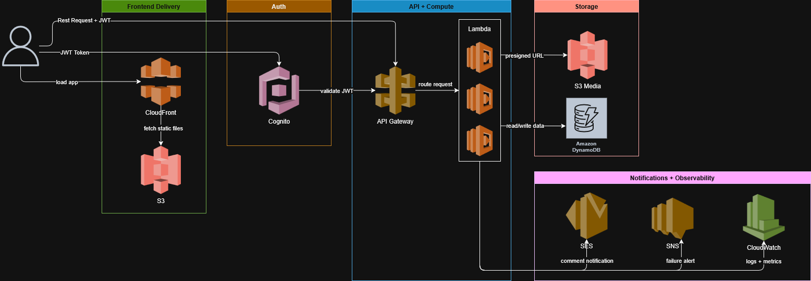

# Overcast

A serverless blogging platform built on AWS. Users can sign up, write posts, upload images, and read content from others.

**Live:** [overcast.jackdrab.dev](https://overcast.jackdrab.dev)
**Video Demo:** [Youtube](https://youtu.be/CknXGr-1p98)
---

## Architecture

Overcast is fully serverless and doesn't use EC2 instances or persistent servers anywhere in the stack. Every component is managed by AWS and scales automatically with traffic.

The frontend is a React single-page application compiled to static files, uploaded to S3, and served globally through CloudFront. CloudFront handles HTTPS termination and caches assets at edge locations, so users get fast load times regardless of location. All API traffic flows through API Gateway, which acts as the single entry point for the backend. API Gateway is configured with a Cognito authorizer, meaning every request is authenticated before it ever reaches a Lambda function (with the exception of a GET request for post info).

Authentication is handled entirely by Cognito. When a user signs up, Cognito sends a verification email and requires confirmation before the account is active. On login, Cognito issues a JWT which the frontend stores in memory and attaches to every subsequent API request as an Authorization header. API Gateway validates this token on every request and unauthenticated requests are rejected at the gateway layer and never reach Lambda.

Lambda functions handle all business logic. There are separate functions for fetching posts, creating posts, and generating presigned S3 upload URLs. Each function has an IAM policy scoped to exactly what it needs. For example, the read function only has DynamoDB read access, the write function only has DynamoDB write access, and the upload URL function only has S3 write access on the media bucket. This follows the principle of least privilege so a compromised function can't access resources it doesn't need.

Post data and user profiles are stored in DynamoDB. DynamoDB was chosen over RDS because the posts are self-contained JSON objects that don't require relational joins. Each post has a UUID primary key generated at write time.

Image uploads use a presigned URL flow. When a user selects an image, the frontend requests a presigned URL from Lambda. Lambda generates a time-limited URL that grants the browser direct write access to a specific S3 key, and returns it along with the final public URL of the image. The browser then uploads the file directly to S3 using that URL, meaning large files never pass through Lambda or API Gateway. The resulting S3 URL is stored as part of the post in DynamoDB.

If a Lambda function fails, the invocation is forwarded to an SNS topic as an async destination. SNS fans the alert out to the developer via email. CloudWatch automatically collects logs and metrics from every Lambda invocation and API Gateway request.

Deployments are fully automated via GitHub Actions. On every push to main, the workflow runs SAM build and deploy for the backend, then builds the React app and syncs it to S3, and finally invalidates the CloudFront cache so users immediately see the new version.

---

## AWS Services

| Service     | Role                                          | Why this over alternatives?                                                                                                                                   |
| ----------- | --------------------------------------------- | ------------------------------------------------------------------------------------------------------------------------------------------------------------- |
| CloudFront  | CDN - serves the frontend globally over HTTPS | S3 alone doesn't support HTTPS on custom domains, and CloudFront caches content at edge locations so load times are faster                                    |
| S3          | Frontend hosting and image storage            | No server needed for static files. For images, presigned URLs let the browser upload directly to S3 without going through Lambda                              |
| Cognito     | User signup, login, and session management    | Handles password hashing, email verification, and JWT issuance without building any of it. Integrates directly with API Gateway                               |
| API Gateway | REST API entry point                          | Validates JWTs automatically before requests reach Lambda. No server to manage compared to running an Express app on EC2                                      |
| Lambda      | Backend logic for posts and image uploads     | Lambda was chosen over EC2 because traffic is unpredictable and infrequent - Lambda only runs when a request comes in so I'm not paying for idle time         |
| DynamoDB    | Stores posts and user data                    | Blog posts are self-contained documents that don't need joins, so a NoSQL database fits better than RDS. Also has a generous free tier                        |
| SNS         | Alerts when a Lambda function fails           | SNS was configured as a Lambda failure destination so failures trigger an email automatically when something crashes instead of having to check logs manually |
| CloudWatch  | Logs and metrics                              | Automatically collects logs from every Lambda invocation with no setup required                                                                               |

---

## Data Flow

1. **User loads the app** - browser hits CloudFront, which serves the React SPA from S3
2. **User signs up** - frontend calls Cognito directly, Cognito sends a verification email, user confirms with the code
3. **User logs in** - Cognito validates credentials and returns a JWT, frontend stores it in memory
4. **User reads posts** - frontend fetches `GET /posts`, which is public and requires no token, Lambda scans DynamoDB and returns all posts
5. **User creates a post** - frontend attaches JWT to `POST /posts`, API Gateway validates it against Cognito, Lambda writes the post to DynamoDB
6. **User uploads an image** - frontend requests a presigned URL from `GET /upload-url`, Lambda generates it with a 5 minute expiry, frontend PUTs the file directly to S3, the resulting URL is stored with the post
7. **Lambda fails** - failed invocation forwarded to SNS topic, SNS emails the developer
8. **Any Lambda invocation** - logs and metrics automatically streamed to CloudWatch
9. **Code pushed to main** - GitHub Actions deploys backend via SAM, builds and syncs frontend to S3, invalidates CloudFront cache

---

## Deployment

Pushes to `main` automatically deploy the full stack via GitHub Actions with no manual intervention required.

---

**Architecture Decisions**

- Chose Lambda over EC2 because traffic is unpredictable and I didn't want to pay for a server sitting idle. A goal of the project was to let people run their own blog for as little time and money as possible.
- Chose DynamoDB over RDS because posts are just documents, there's no real relationship between tables that would need a traditional database. Also has a permanent free tier.
- Chose Cognito over building my own auth because it handles all the hard stuff out of the box and plugs straight into API Gateway. I've built auth from scratch before and it's easy to get wrong.
- Used presigned S3 URLs for image uploads instead of sending files through Lambda. Lambda has a file size limit and this way the browser uploads directly to S3. Took some research to figure out.
- Kept reading posts public and only locked down the write endpoints. You shouldn't need an account just to read a blog. Getting this to work in SAM required digging into the docs.
- Used SAM over writing raw CloudFormation because it's much less verbose. I come from a Docker and Ansible background so writing infrastructure as code felt natural.
- Deployed the frontend to S3 and CloudFront instead of Vercel to keep everything in AWS.

---

**Challenges**

- CORS errors when making POST requests. API Gateway was blocking the preflight request browsers send before every POST. Fixed by adding one line to the SAM template.
- WSL and Windows npm conflict. The project was in the wrong directory so SAM was picking up the Windows version of npm instead of the Linux one. Fixed by moving the project into the WSL filesystem.
- Cognito requires email verification before you can log in, which I hadn't handled in the frontend initially. Had to add a confirmation code step to the signup flow.
- The custom domain kept breaking after deploys because I had added the certificate config manually in the AWS console and GitHub Actions would overwrite it. Fixed by adding it to the template so it's always included in deploys.
- SNS failure destination on Lambda doesn't fire for synchronous invocations, which is how API Gateway calls Lambda. Switched to a CloudWatch alarm on the Lambda error metric that publishes to the SNS topic when errors are detected, which works regardless of how the function was invoked.
- Originally planned to use SES for notifications but it requires verifying every recipient's email which isn't practical. Dropped it.
